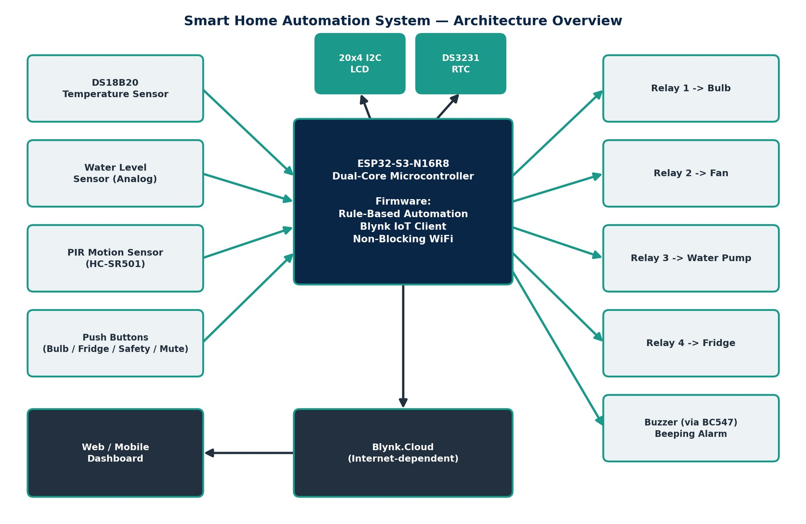
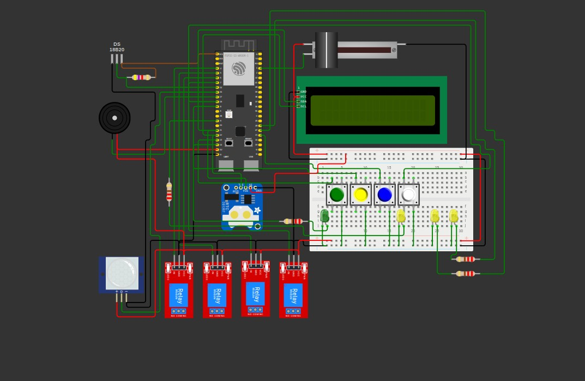
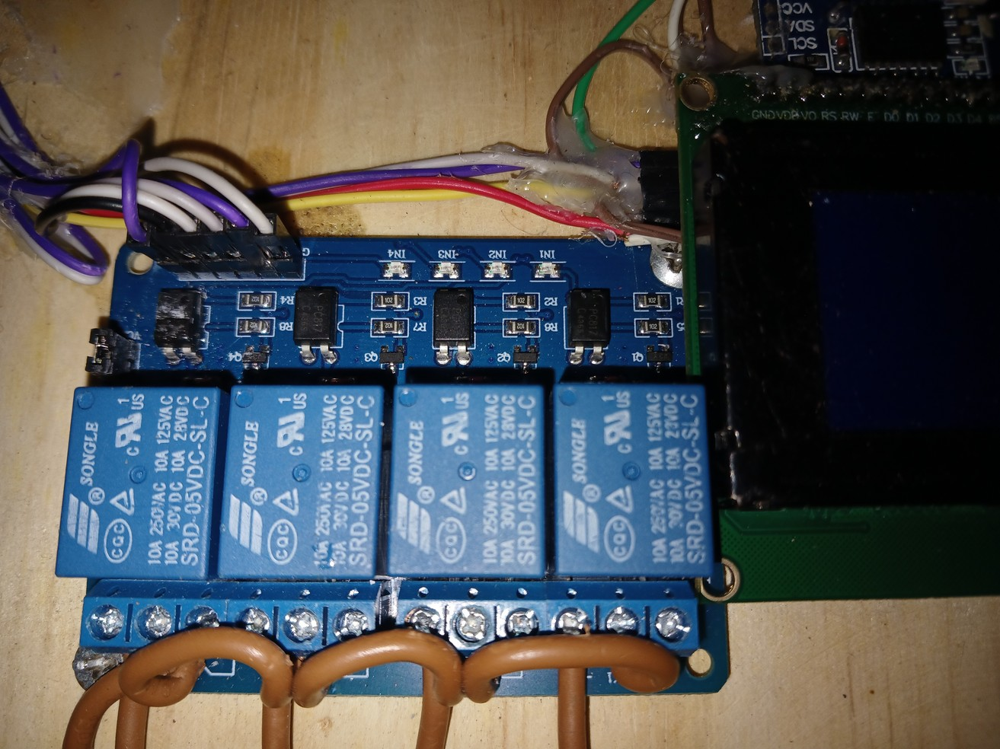
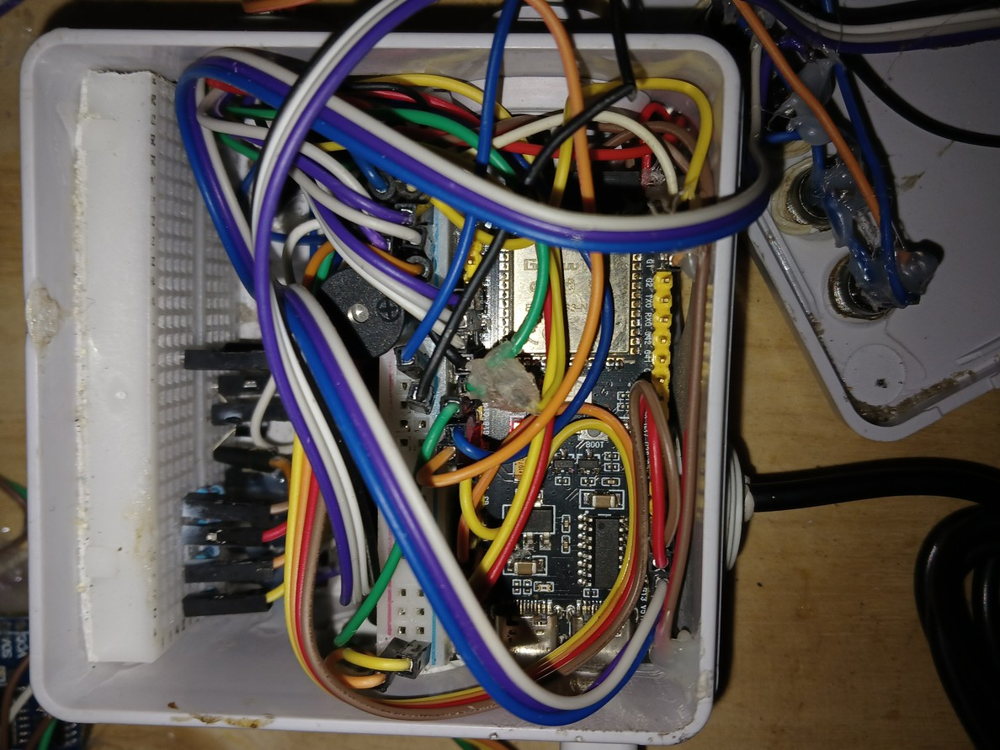
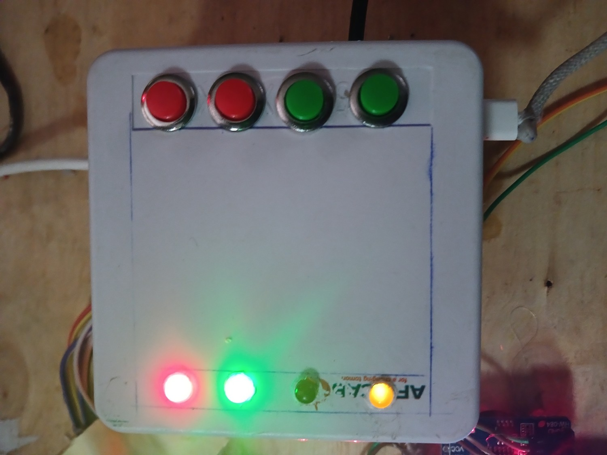
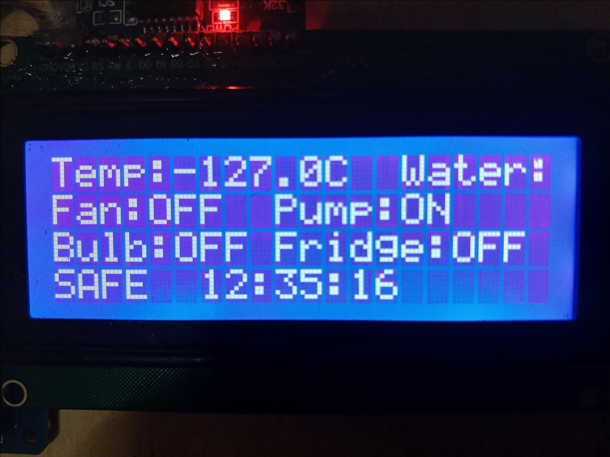
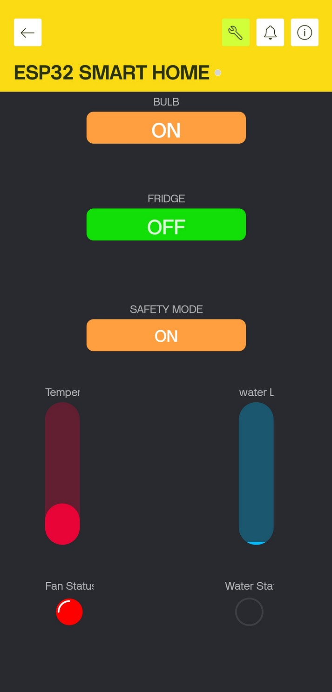

# ESP32-S3 Smart Home Automation System with IoT Dashboard

A microcontroller-based smart home automation and monitoring system built on the **ESP32-S3-N16R8**, combining local rule-based automation with optional remote monitoring and control via the **Blynk IoT platform**.

Final-year diploma project — Dar es Salaam Institute of Technology, Department of Electrical and Computer Engineering (Ordinary Diploma in Biomedical Equipment Engineering, Computer Engineering & Electrical Engineering). Achieved the top result in its cohort and was successfully defended.

**Author:** Frolian Fikiri
**Contact:** fikirifrolian@gmail.com



---

## Overview

Many households — particularly in areas with intermittent utility supply — face two related problems: appliances left running unnecessarily, and no way to check or control the home while away. Commercial smart-home products that solve this are often priced out of reach and are closed, proprietary systems the end user can't inspect, repair, or extend.

This project builds a transparent, low-cost, locally serviceable alternative: a single ESP32-S3 control unit that manages lighting, cooling, water supply, and refrigeration, watches for intrusion and unsafe water levels, and reports status both locally (on an attached LCD) and remotely (via an internet dashboard) — while all safety-critical automation keeps working independently of internet connectivity.

## Features

- **4-channel relay control** — bulb, fan, water pump, and refrigerator
- **Rule-based automation** with hysteresis on the water pump to prevent relay chatter
- **Motion-triggered alarm** with physical arm/disarm and a 60-second mute
- **Local 20x4 I2C LCD** showing live temperature, water level, relay states, and time
- **DS3231 RTC** for offline timekeeping that survives power loss
- **Remote monitoring/control** via Blynk web + mobile dashboard
- **Offline-first design** — local automation and safety functions run with no internet dependency; the system reconnects to Blynk automatically once WiFi returns, no reboot required
- **State persistence** — bulb, fridge, and Safety Mode states are saved to flash (NVS) and restored after power loss

## Hardware

| Component | Purpose |
|---|---|
| ESP32-S3-N16R8 DevKit | Main controller — WiFi + Blynk connectivity |
| 4-Channel 5V Relay Module | Switches bulb, fan, pump, fridge (mains side) |
| DS18B20 Temperature Sensor | Automatic fan control input |
| Water Level Sensor Module | Automatic water pump control input |
| PIR Motion Sensor (HC-SR501) | Motion detection for Safety Mode |
| Active Buzzer Module (5V) | Safety Mode alert output |
| 20x4 LCD Display (I2C) | Local status display |
| DS3231 RTC Module | Offline real-time scheduling, survives power loss |
| Tactile Push Buttons (x4) | Bulb, Fridge, Safety Mode, and Mute overrides |
| BC547 NPN Transistor | Buzzer driver |
| 1N4007 Diodes | Flyback protection on fan/pump/fridge relay coils |
| Inline Fuse Holder (1A) | Mains-side overcurrent protection |
| 18W AC LED Bulbs (x4) | Simulated loads for bulb, fan, pump, fridge |

Full 28-item bill of materials is in [`docs/bill-of-materials.md`](bill-of-materials.md).

## GPIO Assignment

| Peripheral | Signal | GPIO |
|---|---|---|
| Relay 1 | Master Bulb | G4 |
| Relay 2 | Fan | G5 |
| Relay 3 | Water Pump | G6 |
| Relay 4 | Fridge | G7 |
| DS18B20 | 1-Wire Data | G15 |
| Water Level Sensor | Analog (ADC1) | G1 |
| PIR Sensor | Digital In | G16 |
| Buzzer | Digital Out | G17 |
| I2C (LCD + RTC) | SDA / SCL | G11 / G12 |
| Safety Mode Button | Digital In (pull-up) | G21 |
| Fridge Button | Digital In (pull-up) | G14 |
| Bulb Button | Digital In (pull-up) | G13 |
| Mute Button | Digital In (pull-up) | G18 |
| Safety Mode LED | Digital Out | G8 |
| WiFi Status LED | Digital Out | G9 |
| Fan Status LED | Digital Out | G47 |
| Pump Status LED | Digital Out | G48 |

Reserved pins (never used for peripherals): G35–G37 (Octal PSRAM), G0/G3/G45/G46 (boot strapping), G19/G20 (native USB-C), EN/RX0/TX0 (reset + UART0 console).

## Automation Logic

| Actuator | Input | Rule |
|---|---|---|
| Water Pump | Water level (%) | ON at ≤20%, OFF at ≥90% (hysteresis prevents chatter) |
| Cooling Fan | Temperature (°C) | ON above 29.0°C |
| Buzzer Alarm | PIR motion + Safety Mode armed | Pulsed beep (~300ms) while motion persists and not muted |
| Bulb / Fridge | Manual button or Blynk switch | Toggles on press; state persisted in flash |

## Firmware

Full source: [`firmware/SmartHome_ESP32S3.ino`](SmartHome_ESP32S3.ino)

**Libraries required (Arduino IDE Library Manager):**
- `Blynk` (BlynkSimpleEsp32)
- `OneWire`
- `DallasTemperature`
- `LiquidCrystal_I2C`
- `RTClib`
- `Preferences` (bundled with ESP32 core)

**Before flashing:** replace the placeholder `BLYNK_TEMPLATE_ID`, `BLYNK_TEMPLATE_NAME`, `BLYNK_AUTH_TOKEN`, WiFi `ssid`, and `pass` at the top of the sketch with your own values. Never commit real credentials to a public repo.

### Design decisions worth noting

**Active-LOW relay handling.** The relay module used energizes on a LOW signal rather than HIGH — common on low-cost opto-isolated boards but not always specified on the datasheet. Rather than inverting state variables everywhere (which would have made the LCD/dashboard logic harder to reason about), two macros translate logical ON/OFF into the correct physical signal only at the point of writing to the pin:

```cpp
#define RELAY_ON  LOW
#define RELAY_OFF HIGH
digitalWrite(PIN_RELAY_BULB, bulbState ? RELAY_ON : RELAY_OFF);
```

**Non-blocking WiFi connect.** The original `Blynk.begin()` call blocks indefinitely until WiFi connects — meaning safety-critical local automation (motion alarm, water overflow prevention) would never start during a WiFi outage. This was replaced with a bounded 30-second connection attempt, after which the system proceeds to run fully offline, combined with `WiFi.setAutoReconnect(true)` and a periodic reconnection nudge so Blynk resumes automatically the moment connectivity returns — no reboot required.

## Testing & Fault Diagnosis

Three non-trivial faults were found and resolved during bring-up — documented here because the debugging process is as much a part of this project as the working result:

| Fault | Symptom | Root Cause | Fix |
|---|---|---|---|
| Relay switching direction | Relay energised when state = OFF (fully inverted) | Relay board is active-LOW | `RELAY_ON`/`RELAY_OFF` macros isolated to the `digitalWrite()` calls |
| Dashboard virtual-pin mismatch | 6 of 7 Blynk widgets showed wrong/static values | Dashboard rebuilt with widgets in a different order than firmware's original VPIN assignment | Firmware VPIN macros realigned to match the dashboard |
| Unresponsive water pump relay | No click, no LED, on that channel only | Missing common ground between ESP32-S3 logic ground and the relay board's separate supply | Grounds tied together |
| Blocking WiFi at boot | System hung indefinitely with no WiFi | `Blynk.begin()` blocks until connected | 30-second non-blocking timeout; system proceeds offline |

Full test case table and photos of the diagnosis process are in [`docs/testing-and-troubleshooting.md`](testing-and-troubleshooting.md).

## Gallery

| | |
|---|---|
|  |  |
| Simulated circuit schematic (Wokwi) | 4-channel relay module wiring |
|  |  |
| Interior enclosure wiring | Assembled enclosure, front panel |
|  |  |
| Live 20x4 LCD readout during testing | Blynk mobile dashboard |

## Future Work

- Local ESP32-hosted web server (mDNS, e.g. `smarthome.local`) as an internet-independent control interface
- `WiFiManager` integration for reconfiguring WiFi credentials via a captive portal, without reflashing
- Hysteresis on the fan's temperature threshold, matching the water pump's approach
- A lightweight anomaly-detection model on temperature/water-level trends — a step toward AI/ML-integrated embedded systems
- Applying this local-first, cloud-optional architecture to biomedical monitoring contexts (cold-chain refrigeration alarms, patient-area environmental monitoring), where continued local operation during network loss is a genuine safety requirement

## Significance

Beyond its immediate function, this project demonstrates a methodology directly transferable to biomedical equipment engineering: sensor-driven automated control with defined safety thresholds, local fail-safe operation independent of network connectivity, and remote status monitoring — principles shared with ICU environmental monitoring, cold-chain refrigeration for medical reagents, and patient-area environmental control systems.

## License

MIT — see [`LICENSE`](LICENSE).

## Author

**Frolian Fikiri**
Biomedical Equipment Engineering Diploma Student, Dar es Salaam Institute of Technology
Email: fikirifrolian@gmail.com
